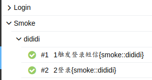

pytest-custom-scheduling: pytest plugin
==============

Support custom grouping. `{group name}`

Rewrite pytest-xdist `pytest_xdist_make_scheduler` function, Modify load scheduling.

Rename testcases name and testcases nodeid, support allure report.

Change testcases nodeid and testcases name encoding to UTF-8 and unicode escape

Format:
  - name: ids
  - nodeid: `group_name::ids`

支持自定义分组 `{分组名}`

使用了pytest-xdist的pytest_xdist_make_scheduler规范方法,修改了负载策略.使得其支持自定义分组

对测试用例名和nodeid进行重命名,方便多个参数化运行同一个测试类使用

对测试用例名和nodeid改为UTF-8编码,使其支持显示中文

格式:
    - 测试名: 进行参数化时的ids参数值
    - nodeid: `首字母大写分组名::ids名`


install
=====

`pip install pytest-custom-scheduling`

Usage
=====

command line:`pytest --switch={on:off} --rename={on:off} -n=auto`

tip: pytest-xdist must be turned on

小贴士: pytest-xdist启用时才会启用该插件

options:
- switch: Used to open plugin, default "off"
- rename: Used to open rename, default "off"

Use `{...}` as a marker custom grouping.

Support "{ filename::classname }" format for multi-level settings

选项:
- switch: 用于开启该插件,默认为"off"关闭
- rename: 用于开启重命名,默认为"off"关闭

在`parametrize`函数ids中,使用 `{...}` 分组标记

支持"{filename::classname}"这种格式进行多级设置



Demo
=====

```python
import pytest


@pytest.mark.parametrize("group", 
                         ["group_1", "group_2", "group_3", "group_4", "group_5", "group_6", 
                          "group_7", "group_8", "group_9", "group_10", "group_11", "group_12"], 
                         ids=["group_1{group_1}", "group_2{group_2}", "group_3{group_3}", 
                              "group_4{group_4}", "group_5{group_5}", "group_6{group_6}", 
                              "group_7{group_7}", "group_8{group_8}", "group_9{group_9}", 
                              "group_10{group_10}", "group_11{group_11}", "group_12{group_12}"])

@pytest.mark.parametrize("group", ["group_4", "group_5", "group_6"], 
                         ids=["group_4{group_5}", "group_5{group_5}", "group_6{group_5}"])
def test_05(group):
    a = "hello"
    b = "world"
    assert a == b
```

cmd line: `pytest --switch=on --rename=on -n=auto`


